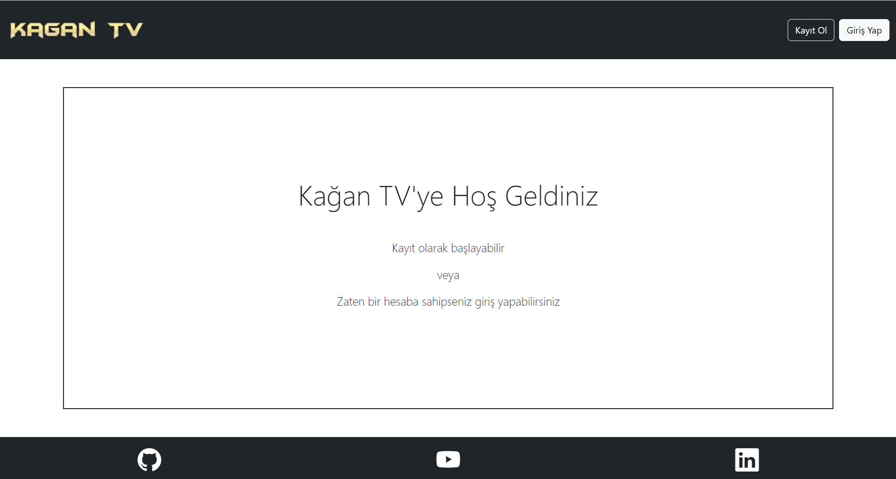
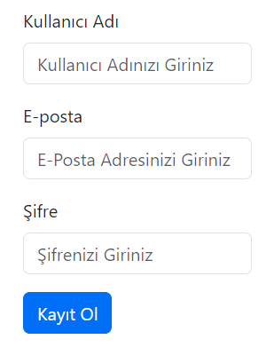
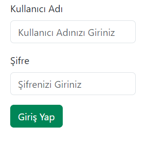
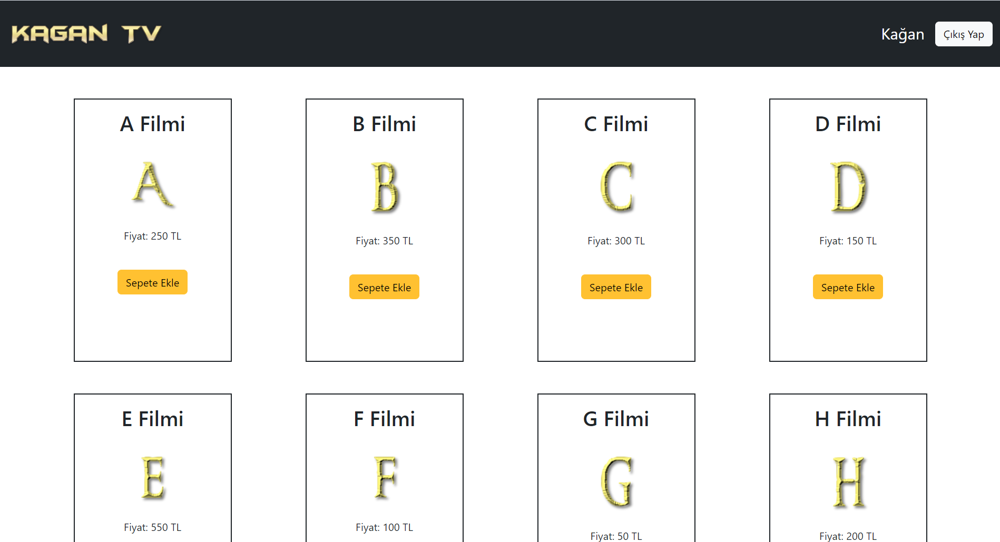

# 🎬 Kağan TV: PHP - MySQL WEB Sayfası

## Proje Açıklaması
Bu proje, PHP, MySQL, HTML ve Bootstrap kütüphanesi kullanılarak geliştirilmiş, Online Dizi Film İzleme Sistemi konulu bir WEB sayfasıdır. Proje kısaca aşağıdaki işlemleri içermektedir:

1. Kullanıcı kaydı, şifreli giriş ve oturum yönetimi  
2. Kullanıcı tarafından bilgi girişi ve veritabanına kayıt  
3. Girilen bilgileri listeleme  
4. Bilgi silme  
5. Bilgileri düzenleme  

Projenin backend kısmı tamamen yalın PHP ile yazılmıştır, hiçbir harici PHP framework/kütüphanesi içermez. Frontend kısmı ise Bootstrap ile stilize edilmiş olup önyüzü JS ile zenginleştirilmiştir.

## 📋 Özellikler

- **Kullanıcı yönetimi**:  
  - Kayıt, giriş, çıkış  
  - Şifreler `password_hash()` ile hash’lenir  
  - Oturum yönetimi `session` ile sağlanır
- **CRUD işlemleri**:  
  - Bilgi ekleme, listeleme, düzenleme ve silme  
- **Veritabanı yapısı**:  
  - En az bir tablo (`accounts`)  
  - `id, username, password, email, cart` alanlarını içerir

## 📂 Proje Yapısı

```
/                             # Proje kök dizini
 ├─ index.php                 # Giriş sayfası
 ├─ login.php                 # Kullanıcıdan giriş bilgilerinin alındığı sayfa
 ├─ login_process.php         # Giriş bilgilerinin arka planda kontrollerinin yapılması
 ├─ register.php              # Kullanıcıdan kayıt bilgilerinin alındığı sayfa
 ├─ register_process.php      # Kayıt bilgilerinin arka planda kontrollerinin yapılması
 ├─ user.php                  # Kullanıcı sayfası
 ├─ add_movie.php             # Sepete film ekleme işlemi
 ├─ update_cart.php           # Sepetteki filmler üzerinde isim değişikliği işlemi
 ├─ remove_from_cart.php      # Sepetteki filmlerin kaldırılması işlemi
 ├─ get_cart.php              # Sepetin görüntülenmesi işlemi
 ├─ logout.php                # Kullanıcı hesabından çıkış işlemi
 ├─ database.php              # Kullanıcı bilgilerinin veri tabanında tutulması işlemi
 ├─ js/
 │   └─ script1.js            # Sepetin görüntülenmesine ilişkin javascript kodları
 │   └─ script2.js            # Sepetin güncellenmesine ilişkin javascript kodları
 └─ sql/
     └─ schema.sql            # Veri Tabanı yapılandırılması
```

## ⚙️ Kurulum

* Siteye şu linkten ulaşabilirsiniz: [Kağan TV WEB Sitesi](http://95.130.171.20/~st23360859059/)

## 🔐 Güvenlik Detayları

- Şifreler **hashlenerek** (`password_hash()`) saklanır.
- Kullanıcı doğrulaması **prepared statements** ile yapılır.
- **Session** ile oturum yönetimi yapılır.
- HTML çıkışları `htmlspecialchars()` ile temizlenir.

## 🧾 Kullanım Talimatları

1. **Kayıt**: `register.php` üzerinden kullanıcı oluşturun.
2. **Giriş**: `index.php` üzerinden oturum açın veya kaydolun.
3. **Ana Sayfa**: `user.php` kullanıcıya özel içerikleri kontrol edin.
4. **Bilgi Ekleme**: `add_movie.php` ile veri girin.
5. **Düzenleme**: `update_cart.php` ile veriyi düzenleyin.
6. **Silme**: `remove_from_cart.php` ile veriyi silin.
7. **Çıkış**: `logout.php` ile oturumu sonlandırın.

## 🖼️ Siteden Görüntüler

### Giriş Sayfası


### Kayıt Olma Paneli


### Giriş Yapma Paneli


### Kullanıcı Sayfası


### Filmlerin Sepette Görünümü ve Film İsminin Güncellenmesi


## 📹 Demo Videosu

* Sitenin çalışmasına ilişkin açıklamalarda bulunduğum demo videosuna şu bağlantıdan ulaşabilirsiniz: [Tanıtım Videosu Linki](https://www.youtube.com/watch?v=a_-Bmqe1NhQ)
